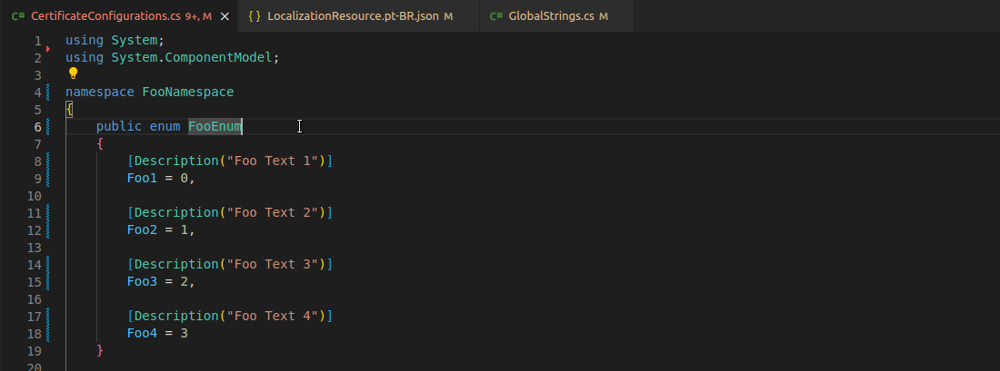

# Grupo Voalle Resource Creator

O Grupo Voalle Resource Creator ajuda na criação dos recursos de internacionalização de mensagens, inserindo o atributo chave valor da string selecionada, aos arquivos de recurso configurados.

## Features

Para utilizar a extensão, selecione um texto que você deseja internacionalizar e então, espere o ícone (lâmpada) de ações rápidas aparecer, ou, utilize o atalho `cntrl + .` para abrir a janela de sugestão, após isso, clique na opão `Gerar recurso para o texto`, então será aberta um input para digitar a chave desse recurso no arquivo json, essa **chave deve iniciar com** `str_s` para frases e `str_f` para campos (palavras).

Veja um exemplo de utilização abaixo:

## Configuration

A Extensão pode ser configurada como configuração de usuário ou de Workspace.

`"grupo-voalle-resource-creator.projectBasePath": ''`  
Essa configuração é obrigatória e é utilizada para indicar o caminho
raíz do projeto.

`"grupo-voalle-resource-creator.resourcesBaseRelativePath": ''`  
Essa configuração é obrigatória e é utilizada para indicar o caminho base para a pasta onde estão os recursos json.

`grupo-voalle-resource-creator.resourceLocalizationBaseName: 'LocalizationResource'`  
Essa configuração é obrigatória e indica o nome inicial dos arquivos de recurso para internacionalização, se vier de um projeto da lib, deve ser passado junto essa informação, ou seja, o texto antes da parte da linguagem, exemplo: LocalizationResource.utility.

`grupo-voalle-resource-creator.fieldClassRelativePath: ''`  
Essa configuração é opcional, mas útil, pois cria automaticamente a constante no arquivo onde ficam as strings com os campos (palavras) .cs passado.

`grupo-voalle-resource-creator.globalClassRelativePath: ''`
Essa configuração é opcional, mas útil, pois cria automaticamente a constante no arquivo onde ficam as strings com os textos (frases) .cs passado.
